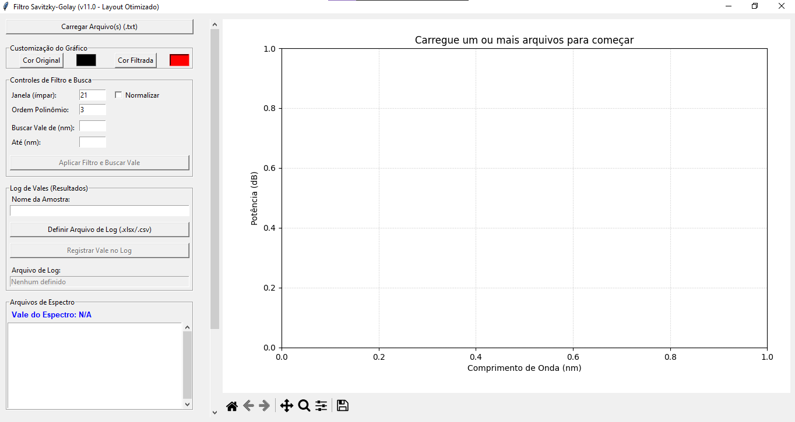

# Filtro Savitzky-Golay para Espectros LPG (v12.0)

Aplicação de desktop em Python (Tkinter + Matplotlib) para carregar, filtrar (Savitzky-Golay) e analisar dados de espectros de fibra óptica (LPGs).

Esta ferramenta permite a análise em lote, detecção de vales de ressonância e exportação de dados e gráficos para relatórios.

> Desenvolvido em: **Python 3** | **Tkinter** | **Matplotlib** | **SciPy** | **Pandas**



-----

## Recursos Principais

  * **Carregamento em Lote:** Carregue múltiplos arquivos `.txt` de uma vez.
  * **Deteção Automática de Delimitador:** Suporta arquivos separados por espaço, vírgula (,) ou ponto-e-vírgula (;).
  * **Filtro Savitzky-Golay:** Aplica um filtro S-G com parâmetros de janela e ordem polinomial customizáveis.
  * **Layout Otimizado (v11):** Interface de duas colunas que maximiza o espaço de visualização do gráfico.
  * **Painel de Controle com Scroll (v12):** Garante que todos os controles estejam acessíveis, mesmo em telas menores.
  * **Visualização Interativa:** Gráfico com zoom e pan (arraste) fornecidos pela barra de ferramentas do Matplotlib.
  * **Detecção de Vale com Faixa de Busca:** Identifica automaticamente o ponto de menor intensidade (vale) dentro de uma faixa de comprimento de onda definida pelo usuário.
  * **Log de Resultados:** Permite salvar um registro contínuo dos vales detectados (data/hora, comprimento de onda, amostra) em arquivos `.xlsx` (Excel) ou `.csv`.
  * **Exportação Múltipla:**
      * Salva o espectro completo (dados originais + filtrados) em `.xlsx` ou `.csv`.
      * Salva a imagem do gráfico completo (original + filtro).
      * Salva uma imagem "limpa" apenas com o filtro, respeitando o zoom e com opções para ocultar anotações.
  * **Customização de Cores:** Permite alterar as cores do gráfico original e filtrado.

-----

## Requisitos

  * Python 3.x
  * `tkinter` (geralmente incluído no Python)
  * `NumPy`
  * `Pandas`
  * `Matplotlib`
  * `SciPy`

-----

## Instalação

1.  Clone este repositório:

    ```bash
    git clone https://github.com/seu-usuario/seu-repositorio.git
    cd seu-repositorio
    ```

2.  (Recomendado) Crie e ative um ambiente virtual:

    ```bash
    python -m venv venv
    source venv/bin/activate  # No Windows: venv\Scripts\activate
    ```

3.  Instale as bibliotecas necessárias usando `pip`:

    ```bash
    pip install numpy pandas matplotlib scipy
    ```

-----

## Como Usar (Fluxo de Trabalho)

1.  Execute o script:

    ```bash
    python filtro_lpg_app_v12.py
    ```

    *(ou o nome que você deu ao arquivo)*

2.  Clique em **"Carregar Arquivo(s) (.txt)"** no painel esquerdo.

3.  O primeiro arquivo da lista será carregado automaticamente. Clique em qualquer nome na lista **"Arquivos de Espectro"** para analisar outro.

4.  Ajuste os parâmetros do filtro (**Janela** e **Ordem Polinômio**).

5.  **Importante:** Defina a **"Faixa de Busca"** (ex: 1500 a 1600) para dizer ao programa onde ele deve procurar o vale, ignorando o ruído em outras regiões.

6.  Clique em **"Aplicar Filtro e Buscar Vale"**.

7.  O gráfico (à direita) será atualizado com a linha do filtro e uma seta apontando para o vale detectado.

8.  Use as ferramentas de **Zoom (Lupa)** e **Pan (Setas Cruzadas)** na barra inferior do gráfico para inspecionar o vale.

9.  Para registrar este resultado, digite um **"Nome da Amostra"** no painel esquerdo.

10. Se for a primeira vez, clique em **"Definir Arquivo de Log"** para criar seu arquivo `resultados.xlsx` (ou `.csv`).

11. Clique em **"Registrar Vale no Log"**.

12. Use os botões de **"Salvar..."** (role o painel esquerdo para baixo, se necessário) para exportar os dados ou imagens.

-----

## Guia da Interface (v11/v12)

A interface é dividida em duas colunas principais para melhor visualização:

### Painel Esquerdo (Controles com Scroll)

Este painel contém todos os controles da aplicação e possui uma barra de rolagem (scrollbar) caso o conteúdo não caiba na altura da tela.

**1. Customização do Gráfico (v10)**

  * **Cor Original:** Abre um seletor de cores para os dados brutos (pontos).
  * **Cor Filtrada:** Abre um seletor de cores para a linha do filtro e suas anotações.

**2. Controles de Filtro e Busca (v7)**

  * **Janela (ímpar):** O número de pontos usados pelo filtro S-G.
  * **Ordem Polinômio:** A ordem do polinômio usado no filtro.
  * **Normalizar:** Move o pico do espectro para 0 dB antes de filtrar.
  * **Buscar Vale de (nm) / Até (nm):** Define o intervalo onde o programa procurará o ponto mínimo.
  * **Aplicar Filtro e Buscar Vale:** O botão principal que processa os dados.

**3. Log de Vales (Resultados) (v6)**

  * **Nome da Amostra:** Campo de texto para identificar seu experimento.
  * **Definir Arquivo de Log:** Abre um janela para criar ou escolher o arquivo `.xlsx` ou `.csv` de resultados.
  * **Registrar Vale no Log:** Botão que adiciona a linha de resultado ao arquivo de log.
  * **Arquivo de Log:** (Rótulo) Mostra o caminho do arquivo de log ativo.

**4. Arquivos de Espectro (v3)**

  * **Vale do Espectro:** (Rótulo) Exibe o resultado numérico do vale encontrado (ex: -25.31 dB @ 1550.45 nm).
  * **Lista de Arquivos:** Exibe todos os `.txt` carregados. Clique em um nome para torná-lo o espectro ativo.

**5. Opções de Salvamento (v4, v8, v9)**

  * **Salvar Espectro Completo (.xlsx/.csv):** Salva todos os dados do espectro ativo (Colunas: Onda, Original, Filtrado).
  * **Salvar Imagem (Completa):** Abre o diálogo de salvamento padrão do Matplotlib para salvar o gráfico como está.
  * **Imagem Apenas do Filtro (Sub-painel):**
      * **Salvar Imagem (Só Filtro):** Salva um `.png` (ou outro formato) contendo apenas a curva filtrada. Respeita o zoom/pan aplicado.
      * **Incluir Anotação (Seta):** Permite remover a seta do vale da imagem salva.
      * **Incluir Faixa (Linhas):** Permite remover as linhas azuis da faixa de busca da imagem salva.

### Painel Direito (Gráfico)

**1. Gráfico (v11)**

  * A visualização principal dos dados. Este painel se expande para usar todo o espaço disponível, corrigindo o problema do gráfico "achatado".

**2. Barra de Ferramentas (v4)**

  * **Barra de Ferramentas (inferior):** Contém os controles do Matplotlib para:
      * **Zoom (Lupa):** Clique para ativar, depois clique e arraste no gráfico.
      * **Pan (Setas Cruzadas):** Clique para ativar, depois clique e arraste para mover o gráfico.
      * **Home (Casa):** Reseta o zoom para a visualização inicial.
      * **(Disquete):** Botão padrão para salvar a imagem (idêntico ao "Salvar Imagem (Completa)").
